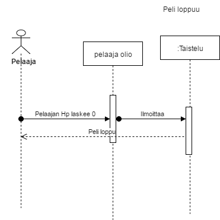
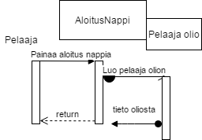

**Aihe:** Toteutetaan yksinkertainen roolipeli jossa p‰‰paino on satunaisesti generoiduilla tapahtumilla ja taisteluilla. Luodaan k‰yttˆj‰rjestelm‰ jossa
k‰ytt‰j‰lle annetaan etuk‰teen p‰‰tettyj‰ vaihtoehtoja reagoida tilanteisiin. Tapahtumien kulku selitet‰‰n k‰ytt‰j‰lle teksti muodossa.
Pyrit‰‰n luomaan tapa pelattavan hahmon kehitt‰miseen ja tapahtumien satunnaisuuden lis‰‰‰miseen uudelleen peluun tekemiseksi mielekk‰‰ksi.

**K‰ytt‰j‰t:** Pelaaja
**Pelaajan toiminnot:** 

-Pelin aloitus   
-Valintojen tekeminen   
-Hahmon kehitys  

  
 